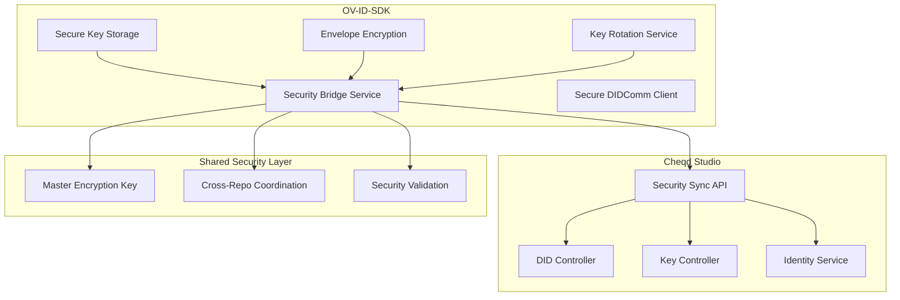

# OV-ID-SDK ↔ Cheqd Studio Integration Guide

## Overview

This guide explains how the enhanced OV-ID-SDK integrates with cheqd-studio to provide enterprise-grade security, cross-repository coordination, and seamless key management across both platforms.

## Architecture Overview



## Key Integration Components

### 1. Security Bridge Service

The `SecurityBridgeService` acts as the primary communication layer between OV-ID-SDK and cheqd-studio.

**Location**: `src/shared/security-bridge.service.ts`

**Key Features**:
- Encrypted data sharing between repositories
- Key synchronization across platforms
- Cross-repository key rotation coordination
- Security state synchronization

### 2. Enhanced Security Services

#### Secure Key Storage
- **File**: `src/security/secure-key-storage.ts`
- **Purpose**: Enterprise-grade encrypted key storage
- **Integration**: Syncs with cheqd-studio key management

#### Envelope Encryption
- **File**: `src/security/envelope-encryption.service.ts`
- **Purpose**: DEK/KEK encryption pattern
- **Integration**: Shared encryption capabilities with cheqd-studio

#### Key Rotation Service
- **File**: `src/security/key-rotation.service.ts`
- **Purpose**: Automated and emergency key rotation
- **Integration**: Coordinates rotation across both platforms

## Setup and Configuration

### 1. Environment Configuration

Configure both OV-ID-SDK and cheqd-studio with matching security settings:

```bash
# OV-ID-SDK .env
OV_MASTER_ENCRYPTION_KEY=your-32-byte-hex-key-here
OV_CHEQD_STUDIO_ENDPOINT=https://your-cheqd-studio.com
OV_CHEQD_STUDIO_SECRET=your-shared-secret
OV_ENABLE_CROSS_REPO_SYNC=true
OV_ENABLE_ENVELOPE_ENCRYPTION=true
OV_ENABLE_MEMORY_PROTECTION=true
OV_KEY_ROTATION_ENABLED=true
```

```bash
# Cheqd Studio .env
OV_SDK_ENDPOINT=https://your-ov-sdk-instance.com
OV_SDK_SECRET=your-shared-secret
OV_ENABLE_SDK_INTEGRATION=true
OV_MASTER_ENCRYPTION_KEY=your-32-byte-hex-key-here
```

### 2. Cheqd Studio API Extensions

Add these endpoints to cheqd-studio for OV-ID-SDK integration:

#### Key Sync API
```typescript
// POST /api/key-sync
interface KeySyncRequest {
  operation: 'create' | 'update' | 'rotate' | 'delete';
  keyId: string;
  did: string;
  customerId: string;
  metadata: any;
}
```

#### Key Rotation Coordination API
```typescript
// POST /api/key-rotation/coordinate
interface KeyRotationPlan {
  did: string;
  customerId: string;
  timestamp: string;
  source: 'ov-id-sdk' | 'cheqd-studio';
}
```

## Integration Implementation

### 1. OV-ID-SDK Side

#### Initialize Security Bridge
```typescript
import { SecurityBridgeService } from '@originvault/ov-id-sdk';

const securityBridge = SecurityBridgeService.getInstance({
  cheqdStudioEndpoint: 'https://your-cheqd-studio.com',
  sharedSecretKey: 'your-shared-secret',
  enableCrossRepoSync: true
});
```

#### Encrypt Data for Cheqd Studio
```typescript
// Encrypt sensitive data before sending to cheqd-studio
const encryptedData = await securityBridge.encryptForCheqdStudio(sensitiveData);

// Send to cheqd-studio
const response = await fetch('https://your-cheqd-studio.com/api/secure-data', {
  method: 'POST',
  headers: {
    'Content-Type': 'application/json',
    'X-OV-SDK-Secret': 'your-shared-secret'
  },
  body: JSON.stringify({ encryptedData })
});
```

#### Sync Key Operations
```typescript
// Sync key creation with cheqd-studio
await securityBridge.syncKeyWithCheqdStudio({
  operation: 'create',
  keyId: 'key-123',
  did: 'did:cheqd:mainnet:abc123',
  customerId: 'customer-456',
  metadata: { keyType: 'Ed25519', purpose: 'authentication' }
});
```

#### Coordinate Key Rotation
```typescript
// Coordinate key rotation across both platforms
await securityBridge.coordinateKeyRotation('did:cheqd:mainnet:abc123', 'customer-456');
```

### 2. Cheqd Studio Side

#### Add Security Sync Middleware
```typescript
// middleware/security-sync.ts
import { SecurityBridgeService } from '@originvault/ov-id-sdk';

export const securitySyncMiddleware = (req: Request, res: Response, next: NextFunction) => {
  const secret = req.headers['x-ov-sdk-secret'];
  
  if (secret !== process.env.OV_SDK_SECRET) {
    return res.status(401).json({ error: 'Invalid security secret' });
  }
  
  // Validate and process security sync requests
  next();
};
```

#### Extend Key Controller
```typescript
// controllers/api/key-sync.ts
export class KeySyncController {
  @validate(securitySyncMiddleware)
  async syncKey(req: Request, res: Response) {
    const { operation, keyId, did, customerId, metadata } = req.body;
    
    try {
      // Process key sync operation
      switch (operation) {
        case 'create':
          await this.createKey(keyId, did, customerId, metadata);
          break;
        case 'update':
          await this.updateKey(keyId, did, customerId, metadata);
          break;
        case 'rotate':
          await this.rotateKey(keyId, did, customerId, metadata);
          break;
        case 'delete':
          await this.deleteKey(keyId, did, customerId, metadata);
          break;
      }
      
      res.json({ success: true, operation, keyId });
    } catch (error) {
      res.status(500).json({ error: error.message });
    }
  }
}
```

#### Add Key Rotation Coordination
```typescript
// controllers/api/key-rotation.ts
export class KeyRotationController {
  @validate(securitySyncMiddleware)
  async coordinateRotation(req: Request, res: Response) {
    const { did, customerId, timestamp, source } = req.body;
    
    try {
      // Coordinate key rotation with OV-ID-SDK
      await this.coordinateWithOVSDK(did, customerId, timestamp, source);
      
      res.json({ success: true, coordinated: true });
    } catch (error) {
      res.status(500).json({ error: error.message });
    }
  }
}
```

## Security Features Integration

### 1. Shared Encryption

Both platforms use the same master encryption key for seamless data sharing:

```typescript
// OV-ID-SDK
const envelopeService = EnvelopeEncryptionService.getInstance();
const encryptedData = await envelopeService.encrypt(sensitiveData);

// Cheqd Studio
const decryptedData = await envelopeService.decrypt(encryptedData);
```

### 2. Cross-Repository Key Rotation

When a key is rotated in one platform, it's automatically coordinated with the other:

```typescript
// OV-ID-SDK triggers rotation
const rotationService = KeyRotationService.getInstance();
const result = await rotationService.emergencyRotation(did, password);

// Automatically syncs with cheqd-studio
// Cheqd Studio receives notification and updates its records
```

### 3. Security State Synchronization

Both platforms maintain synchronized security states:

```typescript
// OV-ID-SDK
const validationService = SecurityValidationService.getInstance();
const securityReport = await validationService.generateSecurityReport();

// Sync with cheqd-studio
await securityBridge.syncSecurityState(securityReport);
```

## API Endpoints

### OV-ID-SDK Security Bridge Endpoints

| Endpoint | Method | Purpose |
|----------|--------|---------|
| `/api/security/encrypt` | POST | Encrypt data for cheqd-studio |
| `/api/security/decrypt` | POST | Decrypt data from cheqd-studio |
| `/api/security/sync-key` | POST | Sync key operations |
| `/api/security/rotate-key` | POST | Coordinate key rotation |
| `/api/security/validate` | GET | Security state validation |

### Cheqd Studio Integration Endpoints

| Endpoint | Method | Purpose |
|----------|--------|---------|
| `/api/key-sync` | POST | Receive key sync operations |
| `/api/key-rotation/coordinate` | POST | Coordinate key rotation |
| `/api/security/state` | GET | Get security state |
| `/api/security/validate` | POST | Validate security configuration |

## Error Handling and Recovery

### 1. Connection Failures

```typescript
// OV-ID-SDK with retry logic
const maxRetries = 3;
let retryCount = 0;

while (retryCount < maxRetries) {
  try {
    await securityBridge.syncKeyWithCheqdStudio(request);
    break;
  } catch (error) {
    retryCount++;
    if (retryCount === maxRetries) {
      // Log error and continue with local operation
      console.error('Failed to sync with cheqd-studio after retries:', error);
    } else {
      // Wait before retry
      await new Promise(resolve => setTimeout(resolve, 1000 * retryCount));
    }
  }
}
```

### 2. Data Consistency

```typescript
// Periodic consistency check
setInterval(async () => {
  try {
    const localKeys = await keyStorage.listKeys();
    const remoteKeys = await securityBridge.getRemoteKeys();
    
    // Compare and sync if needed
    await this.ensureConsistency(localKeys, remoteKeys);
  } catch (error) {
    console.error('Consistency check failed:', error);
  }
}, 5 * 60 * 1000); // Every 5 minutes
```

## Monitoring and Logging

### 1. Security Event Logging

```typescript
// OV-ID-SDK
const securityLogger = {
  logKeyOperation: (operation: string, keyId: string, success: boolean) => {
    console.log(`[SECURITY] ${operation} ${keyId}: ${success ? 'SUCCESS' : 'FAILED'}`);
  },
  
  logSyncOperation: (operation: string, target: string, success: boolean) => {
    console.log(`[SYNC] ${operation} to ${target}: ${success ? 'SUCCESS' : 'FAILED'}`);
  }
};
```

### 2. Performance Monitoring

```typescript
// Monitor encryption/decryption performance
const performanceMonitor = {
  measureEncryption: async (data: string) => {
    const start = Date.now();
    const result = await envelopeService.encrypt(data);
    const duration = Date.now() - start;
    
    console.log(`[PERF] Encryption: ${duration}ms, Size: ${data.length} bytes`);
    return result;
  }
};
```

## Testing Integration

### 1. Integration Tests

```typescript
// tests/integration/cheqd-studio-integration.test.ts
describe('Cheqd Studio Integration', () => {
  test('should sync key creation', async () => {
    const securityBridge = SecurityBridgeService.getInstance({
      cheqdStudioEndpoint: 'http://localhost:3001',
      sharedSecretKey: 'test-secret',
      enableCrossRepoSync: true
    });
    
    const result = await securityBridge.syncKeyWithCheqdStudio({
      operation: 'create',
      keyId: 'test-key-123',
      did: 'did:cheqd:testnet:abc123',
      customerId: 'test-customer',
      metadata: { test: true }
    });
    
    expect(result).toBeDefined();
  });
});
```

### 2. Security Validation Tests

```typescript
// tests/security/cross-repo-security.test.ts
describe('Cross-Repository Security', () => {
  test('should maintain encryption consistency', async () => {
    const data = 'sensitive test data';
    
    // Encrypt in OV-ID-SDK
    const encrypted = await securityBridge.encryptForCheqdStudio(data);
    
    // Decrypt in cheqd-studio (simulated)
    const decrypted = await securityBridge.decryptFromCheqdStudio(encrypted);
    
    expect(decrypted).toBe(data);
  });
});
```

## Deployment Considerations

### 1. Environment Setup

1. **Shared Master Key**: Both platforms must use the same `OV_MASTER_ENCRYPTION_KEY`
2. **Network Security**: Use TLS for all communications
3. **Secret Management**: Store shared secrets securely
4. **Monitoring**: Set up comprehensive logging and monitoring

### 2. Production Checklist

- [ ] Master encryption key configured and backed up
- [ ] TLS certificates installed and valid
- [ ] Shared secrets configured securely
- [ ] Network connectivity between platforms verified
- [ ] Security validation tests passing
- [ ] Monitoring and alerting configured
- [ ] Backup and recovery procedures tested

## Troubleshooting

### Common Issues

1. **Connection Timeout**
   - Check network connectivity
   - Verify endpoint URLs
   - Check firewall settings

2. **Authentication Failures**
   - Verify shared secret configuration
   - Check secret key format
   - Ensure secrets match on both platforms

3. **Encryption/Decryption Errors**
   - Verify master encryption key is identical
   - Check key format (32-byte hex)
   - Ensure both platforms use same encryption version

4. **Sync Failures**
   - Check API endpoint availability
   - Verify request/response formats
   - Review error logs for details

### Debug Mode

Enable debug logging for troubleshooting:

```bash
# OV-ID-SDK
OV_SECURITY_LOG_LEVEL=debug
OV_ENABLE_DETAILED_SECURITY_LOGS=true

# Cheqd Studio
DEBUG=ov-sdk-integration
LOG_LEVEL=debug
```

## Security Best Practices

1. **Key Management**
   - Use strong, unique master encryption keys
   - Rotate keys regularly
   - Store keys securely (HSM recommended for production)

2. **Network Security**
   - Use TLS 1.3 for all communications
   - Implement certificate pinning
   - Use VPN or private networks when possible

3. **Access Control**
   - Implement proper authentication
   - Use least privilege principle
   - Monitor and audit all access

4. **Data Protection**
   - Encrypt all sensitive data in transit and at rest
   - Implement data retention policies
   - Regular security audits

## Support and Maintenance

### Regular Maintenance Tasks

1. **Weekly**
   - Review security logs
   - Check sync status
   - Validate encryption consistency

2. **Monthly**
   - Security validation reports
   - Performance optimization
   - Update documentation

3. **Quarterly**
   - Comprehensive security audit
   - Penetration testing
   - Disaster recovery testing

### Getting Help

- **Documentation**: Check this guide and SECURITY-ENHANCEMENT-PLAN.md
- **Issues**: Report issues in the GitHub repository
- **Security**: Report security issues privately to security@originvault.box

---

This integration guide provides a comprehensive framework for securely connecting OV-ID-SDK with cheqd-studio, enabling enterprise-grade security features across both platforms.
